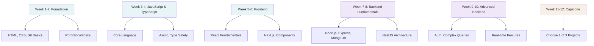

# 12-Week MERN Stack Course: Beginner to Internship-Ready

## Course Overview

This 12-week course transforms you from a beginner to an internship-ready full-stack developer. The first 6 weeks focus on foundational technologies (HTML, CSS, JavaScript, TypeScript, Node.js, and React). Weeks 7-12 dive deep into advanced backend patterns, production-grade frontend architecture, and building one of three capstone projects.

**Target Audience**: Engineering background students with basic programming knowledge  
**Format**: Self-paced learning + 2-4 hours weekly live sessions for doubt clearance  
**Assessment**: Daily task checklists, weekly code reviews, capstone project evaluation  

---

## 📊 Course Structure Overview

---

## 📅 Week-by-Week Breakdown

### **Phase 1: Foundation (Weeks 1-2)**

| Week | Topics | Deliverable |
|------|--------|-------------|
| **1** | HTML5, CSS3, Responsive Design, GitHub Pages | Portfolio Website (Zero AI) |
| **2** | Advanced CSS, Design Systems, Accessibility | Responsive Portfolio + Animations |

### **Phase 2: Language Fundamentals (Weeks 3-4)**

| Week | Topics | Focus |
|------|--------|-------|
| **3** | JavaScript Basics, TypeScript Introduction | Core concepts + Type Safety |
| **4** | Async/Await, Advanced TS, Generics | Production patterns |

### **Phase 3: Frontend Mastery (Weeks 5-6)**

| Week | Topics | Focus |
|------|--------|-------|
| **5** | React Hooks, Components, State Management | Fundamentals |
| **6** | Next.js, Routing, SSR, Optimization | Full-stack React |

### **Phase 4: Backend Fundamentals (Weeks 7-8)**

| Week | Topics | Focus |
|------|--------|-------|
| **7** | Node.js, Express, MongoDB, REST APIs | Server Setup |
| **8** | NestJS, Authentication, JWT, Middleware | Scalable Architecture |

### **Phase 5: Advanced Backend (Weeks 9-10)**

| Week | Topics | Focus |
|------|--------|-------|
| **9** | Mongoose, Aggregations, Data Validation | Complex Queries |
| **10** | WebSockets, Redis, File Uploads, Jobs | Real-time Features |

### **Phase 6: Capstone Projects (Weeks 11-12)**

| Week | Activity | Focus |
|------|----------|-------|
| **11-12** | Group Project Development | Full MERN Integration |

---

## 🎯 Technology Stack

### Frontend
- HTML5, CSS3, JavaScript (ES2020+)
- TypeScript - Type safety
- React - UI library with hooks
- Next.js - Full-stack framework
- Tailwind CSS - Styling

### Backend
- Node.js - Runtime
- Express.js - Framework
- NestJS - Full-featured backend
- TypeScript - Type-safe code
- MongoDB - Database
- Mongoose - MongoDB ODM

### Tools
- Git & GitHub
- npm/yarn
- Postman
- VS Code

---

## 💡 Capstone Projects (Choose 1)

### 1. **Internship Platform**
Organizations post internships → Students apply → Track applications

### 2. **Assignment Tracking System**
Admin/Orgs post assignments → Students submit files → Track progress

### 3. **College Dashboard**
View student profiles → Placement tracking → Analytics & reporting

---

## 📊 Assessment Rubric (Capstone - 100 points)

| Criteria | Points | Focus |
|----------|--------|-------|
| Code Quality | 25 | TypeScript, Architecture, SOLID |
| Feature Completeness | 25 | MVP requirements |
| Git Workflow | 15 | Commits, branching |
| Documentation | 15 | README, API docs, Schema |
| Testing & Error Handling | 10 | Validation, edge cases |
| Presentation | 10 | Demo clarity, Q&A |

---

## ✅ Success Checklist

- [ ] **Week 2**: Portfolio deployed, Git mastery
- [ ] **Week 4**: JavaScript & TypeScript fundamentals
- [ ] **Week 6**: React & Next.js proficiency
- [ ] **Week 8**: Backend API basics
- [ ] **Week 10**: Authentication & advanced patterns
- [ ] **Week 12**: Complete capstone project

---

## 🚀 Begin Your Journey

**Start with Week 1**: [WEEK-01.md](./WEEK-01.md)
