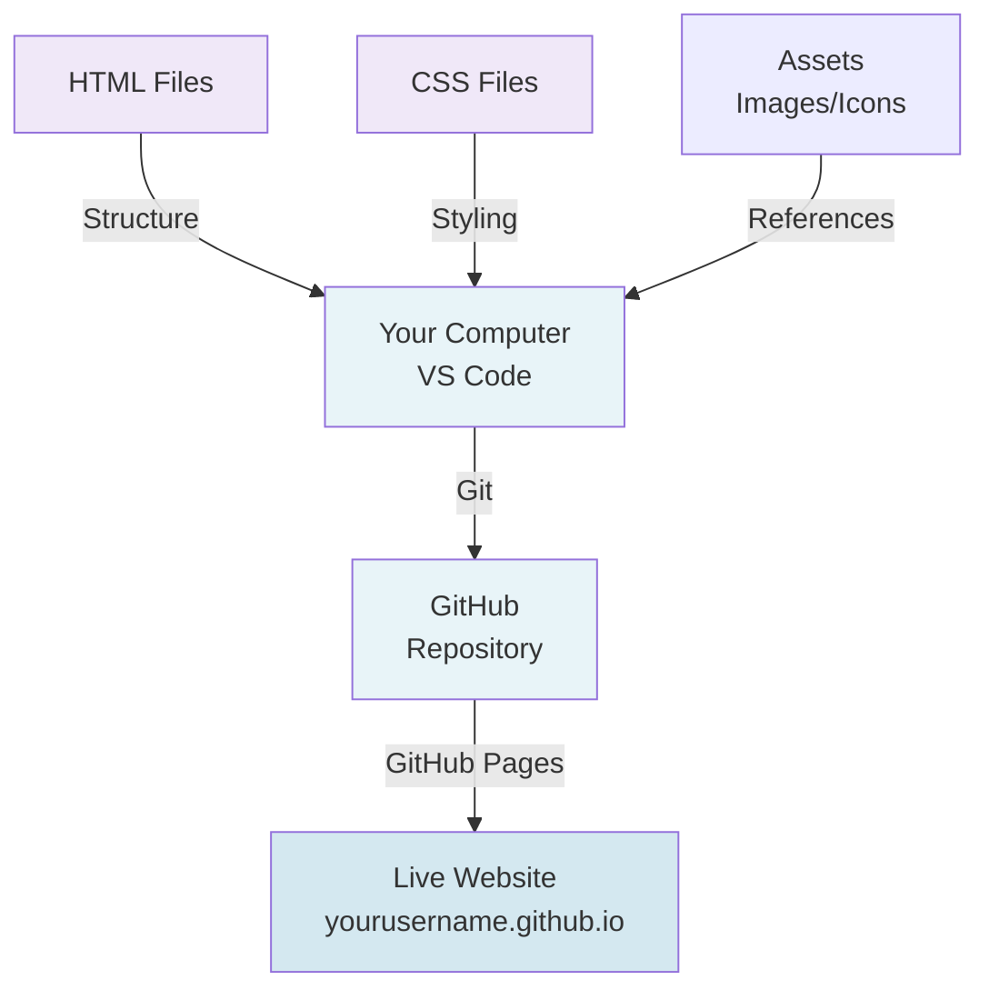
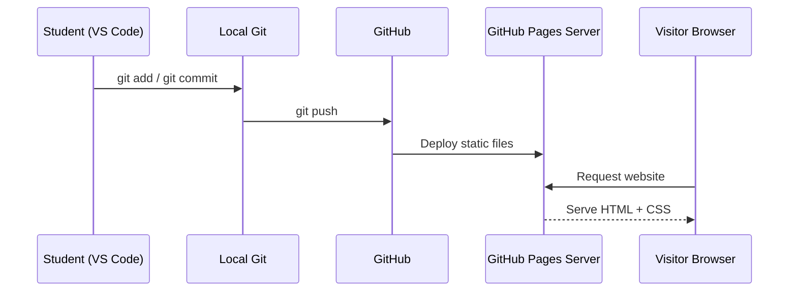
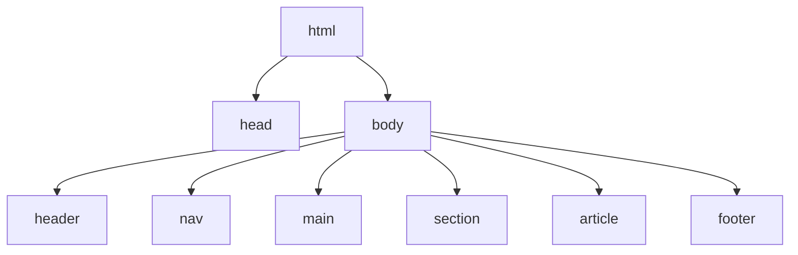
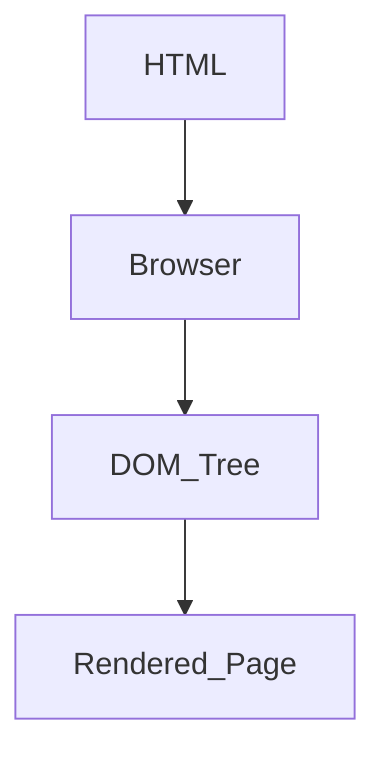
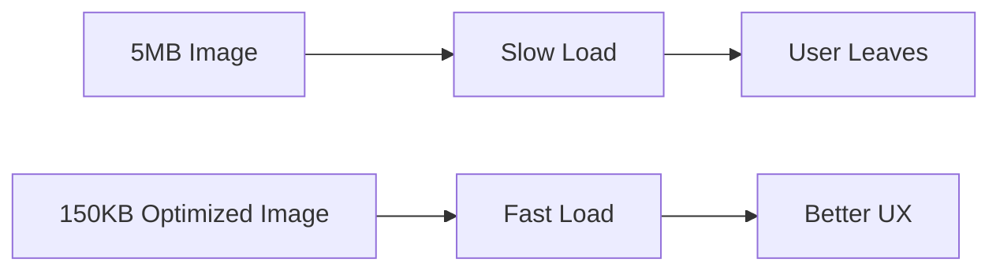
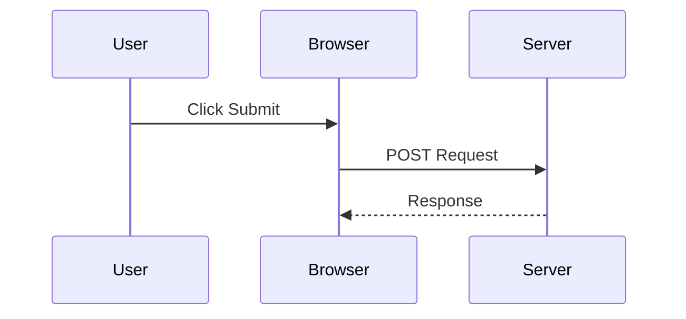
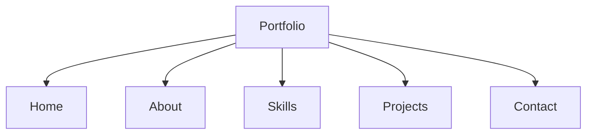
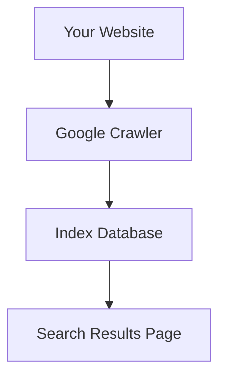

# Week 1: Portfolio Website & Git Fundamentals

## 📌 Week Overview

This week, you'll build a personal portfolio website using **pure HTML5 and CSS3** (NO AI assistance). This is your foundation for understanding how the web works. You'll also learn Git and deploy your site on GitHub Pages.

**Duration**: 7 days  
**Time Commitment**: 2-3 hours per day  
**Deliverable**: Live portfolio on GitHub Pages with proper Git history

---

## 🎯 Learning Outcomes

By end of Week 1, you will:
* ✅ Understand semantic HTML5 structure
* ✅ Master CSS Grid & Flexbox layouts
* ✅ Build responsive designs (mobile-first)
* ✅ Use Git for version control
* ✅ Deploy on GitHub Pages
* ✅ Follow professional naming conventions
* ✅ Understand how browser rendering works (DOM + CSSOM)
* ✅ Build accessible and performance-optimized pages

---

## 📊 Architecture Overview



### 🔍 What Is Actually Happening?



### 🧠 Key Insight:

GitHub Pages is a **static file server**.

It does NOT:
* Run Node.js
* Run databases
* Process forms

It only serves:
* `.html`
* `.css`
* images
* static assets

---

## Day 1: HTML5 Semantic Structure

### Morning Lesson (30 min)

**What is HTML?**

HTML (HyperText Markup Language) is the structure of every website. It defines meaning and hierarchy.

---

## 🧱 Visual Representation of HTML Structure




### 🌳 What Is DOM?

When browser reads HTML:



* Every tag becomes a node.
* HTML forms a tree.
* CSS selects these nodes.
* JS (later) manipulates them.

**Semantic vs Non-Semantic HTML**:
```html
<!-- ❌ Non-semantic (unclear meaning) -->
<div>
  <div>Welcome to my portfolio</div>
  <div>I'm a developer</div>
</div>

<!-- ✅ Semantic (clear meaning) -->
<header>
  <h1>Welcome to my portfolio</h1>
</header>
<main>
  <p>I'm a developer</p>
</main>
```

**Key Semantic Elements** [^1]
- `<header>` - Header/navigation area
- `<nav>` - Navigation links
- `<main>` - Main content area
- `<article>` - Self-contained content
- `<section>` - Thematic grouping
- `<aside>` - Sidebar, supplementary content
- `<footer>` - Footer information

**Why Semantic HTML Matters**:
- Better SEO (search engines understand your content)
- Accessibility (screen readers navigate better)
- Cleaner code (easier to maintain)

---

### Practical Exercise (90 min)

**Project**: Create a portfolio homepage structure

**Requirements**:
1. Create project folder: `my-portfolio/`
2. Create `index.html` file
3. Include all semantic elements

**Starter Code**:
```html
<!DOCTYPE html>
<html lang="en">
<head>
    <meta charset="UTF-8">
    <meta name="viewport" content="width=device-width, initial-scale=1.0">
    <title>Your Name - Portfolio</title>
    <link rel="stylesheet" href="styles.css">
</head>
<body>
    <header>
        <nav>
            <ul>
                <li><a href="#home">Home</a></li>
                <li><a href="#about">About</a></li>
                <li><a href="#projects">Projects</a></li>
                <li><a href="#contact">Contact</a></li>
            </ul>
        </nav>
    </header>

    <main>
        <section id="home">
            <h1>Hello, I'm [Your Name]</h1>
            <p>Full Stack Developer | MERN Stack Enthusiast</p>
        </section>

        <section id="about">
            <h2>About Me</h2>
            <p>Write a brief bio about yourself</p>
        </section>

        <section id="projects">
            <h2>My Projects</h2>
            <!-- Will add project cards here -->
        </section>

        <section id="contact">
            <h2>Get In Touch</h2>
            <p>Email: your@email.com</p>
        </section>
    </main>

    <footer>
        <p>&copy; 2024 Your Name. All rights reserved.</p>
    </footer>
</body>
</html>
```

**Meta Tags Explained** [^2]
```html
<!-- Character encoding - essential for non-ASCII characters -->
<meta charset="UTF-8">

<!-- Viewport - makes site responsive on mobile -->
<meta name="viewport" content="width=device-width, initial-scale=1.0">

<!-- For search engines -->
<meta name="description" content="A brief description of your portfolio">
<meta name="keywords" content="developer, portfolio, MERN">

<!-- Social media sharing (Open Graph) -->
<meta property="og:title" content="Your Portfolio">
<meta property="og:description" content="I build web applications">
<meta property="og:image" content="thumbnail.jpg">
```

---

### Challenge Exercise (30 min)

Expand your HTML with:
1. Add profile image in hero section
2. Create at least 3 project cards (dummy content OK)
3. Add links to social profiles (GitHub, LinkedIn)
4. Include all semantic tags properly

---

### Git & Commit (30 min)

**Install Git**: https://git-scm.com/downloads

**Basic Git Commands** [^3]
```bash
# Initialize repository
git init

# Check status
git status

# Add files to staging
git add .

# Commit with message
git commit -m "feat: add semantic HTML structure for portfolio"

# View commit history
git log --oneline
```

**Commit Message Format** (Conventional Commits) [^4]
```
<type>(<scope>): <description>

Types: feat, fix, docs, style, refactor
Example: feat(portfolio): add semantic HTML structure
```

---

### Daily Checklist
- [ ] Created project folder `my-portfolio/`
- [ ] Created `index.html` with semantic structure
- [ ] Added all 5 main sections (header, hero, about, projects, contact)
- [ ] Initialized Git repository
- [ ] Made first commit: "feat: add semantic HTML structure"

---

---

## Day 2: Images, Attributes & Accessibility

### ⚡ How Images Affect Performance




Key Takeaway:
Performance = User Experience.

---

### Morning Lesson (30 min)

**HTML Attributes - Give Elements Extra Info**:
```html
<!-- class: for styling -->
<div class="container">

<!-- id: for unique identification -->
<section id="projects">

<!-- data attributes: store custom data -->
<div data-project-id="123">

<!-- aria attributes: for accessibility -->
<button aria-label="Close menu">×</button>
```

**Images Best Practices** [^5]
```html
<!-- ❌ Bad: No alt text, no optimization -->


<!-- ✅ Good: Descriptive alt, responsive -->


<!-- ✅ Best: Picture element for responsive images -->
<picture>
    <source media="(max-width: 600px)" srcset="photo-mobile.jpg">
    <source media="(min-width: 601px)" srcset="photo-desktop.jpg">
    
</picture>
```

**Accessibility (A11y) Fundamentals** [^6]
- Always use alt text for images
- Use semantic HTML (h1, h2, h3 in order)
- Color should not be only way to convey info
- Sufficient contrast ratio (WCAG AA: 4.5:1 for text)

---

### Practical Exercise (90 min)

**Task**: Add images and optimize your portfolio

1. **Prepare Images**:
   - Download your profile photo (or use placeholder)
   - Create project screenshots/thumbnails
   - Add to `assets/images/` folder

2. **Update HTML**:
```html
<section id="projects">
    <h2>My Projects</h2>
    <div class="projects-grid">
        
        <article class="project-card">
            
            <h3>E-commerce Platform</h3>
            <p>React, Node.js, MongoDB</p>
            <a href="https://github.com/yourname/project">View Code</a>
        </article>

        <!-- Repeat for more projects -->
    </div>
</section>
```

3. **File Structure**:
```
my-portfolio/
├── index.html
├── styles.css
└── assets/
    └── images/
        ├── profile.jpg
        ├── project-1.jpg
        ├── project-2.jpg
        └── project-3.jpg
```

---

### Challenge Exercise (30 min)

1. Add proper alt text to ALL images
2. Create an image optimization checklist:
   - [ ] Images are < 200KB each
   - [ ] All images have alt text
   - [ ] All images have width/height attributes

---

### Git Commit (15 min)

```bash
git add assets/
git add index.html
git commit -m "feat(portfolio): add project cards with images and alt text"
```

---

### Daily Checklist
- [ ] Added all images to assets folder
- [ ] Updated HTML with proper image tags
- [ ] Added descriptive alt text to all images
- [ ] Added width/height attributes
- [ ] Committed changes with meaningful message

---

---

## Day 3: Forms & User Input

### 🔄 What Happens When You Submit a Form?



Important:
GitHub Pages does NOT process forms.

Forms need backend (Node.js/Express) — which you will learn later.

### Morning Lesson (30 min)

**HTML Forms - Collect User Data**:
```html
<!-- Basic form structure -->
<form action="/api/contact" method="POST">
    
    <!-- Text input -->
    <label for="name">Name:</label>
    <input 
        type="text" 
        id="name" 
        name="name" 
        required
        placeholder="Your full name"
    >

    <!-- Email input (browser validates) -->
    <label for="email">Email:</label>
    <input 
        type="email" 
        id="email" 
        name="email" 
        required
    >

    <!-- Textarea for longer text -->
    <label for="message">Message:</label>
    <textarea 
        id="message" 
        name="message" 
        rows="5"
        placeholder="Your message here..."
    ></textarea>

    <!-- Radio buttons (single choice) -->
    <label>How did you find me?</label>
    <input type="radio" name="source" value="github"> GitHub
    <input type="radio" name="source" value="linkedin"> LinkedIn
    <input type="radio" name="source" value="referral"> Referral

    <!-- Checkboxes (multiple choices) -->
    <label>Skills interested in:</label>
    <input type="checkbox" name="skills" value="frontend"> Frontend
    <input type="checkbox" name="skills" value="backend"> Backend
    <input type="checkbox" name="skills" value="fullstack"> Full Stack

    <!-- Select dropdown -->
    <label for="experience">Experience Level:</label>
    <select id="experience" name="experience">
        <option value="">--Select--</option>
        <option value="beginner">Beginner</option>
        <option value="intermediate">Intermediate</option>
        <option value="expert">Expert</option>
    </select>

    <!-- Submit button -->
    <button type="submit">Send Message</button>
    <button type="reset">Clear Form</button>
</form>
```

**Input Types Available** [^7]
- `text`, `email`, `password`, `number`
- `date`, `time`, `datetime-local`
- `tel`, `url`
- `checkbox`, `radio`
- `file`, `color`, `range`

**Accessibility in Forms** [^8]
- ALWAYS use `<label>` with `for` attribute
- Use `required` attribute for mandatory fields
- Provide `placeholder` text as HINT, not label
- Use `aria-label` for icon-only buttons

---

### Practical Exercise (90 min)

**Task**: Add a contact form to your portfolio

```html
<section id="contact">
    <h2>Get In Touch</h2>
    
    <form id="contact-form" action="#" method="POST">
        
        <div class="form-group">
            <label for="name">Full Name *</label>
            <input 
                type="text" 
                id="name" 
                name="name"
                required
                minlength="2"
                maxlength="100"
            >
        </div>

        <div class="form-group">
            <label for="email">Email Address *</label>
            <input 
                type="email" 
                id="email" 
                name="email"
                required
            >
        </div>

        <div class="form-group">
            <label for="subject">Subject *</label>
            <select id="subject" name="subject" required>
                <option value="">--Select--</option>
                <option value="inquiry">General Inquiry</option>
                <option value="collaboration">Collaboration</option>
                <option value="feedback">Feedback</option>
            </select>
        </div>

        <div class="form-group">
            <label for="message">Message *</label>
            <textarea 
                id="message" 
                name="message"
                rows="6"
                required
                minlength="10"
                maxlength="1000"
            ></textarea>
        </div>

        <div class="form-group">
            <input type="checkbox" id="terms" name="terms" required>
            <label for="terms">I agree to be contacted</label>
        </div>

        <button type="submit" class="btn-primary">Send Message</button>
        <button type="reset" class="btn-secondary">Clear</button>
    </form>
</section>
```

---

### Challenge Exercise (30 min)

1. Add form validation attributes (required, minlength, maxlength)
2. Create a newsletter signup form in footer
3. Add proper error message structure (hidden, shown on validation)

---

### Git Commit (15 min)

```bash
git add index.html
git commit -m "feat(portfolio): add contact form with validation"
```

---

### Daily Checklist
- [ ] Created contact form with multiple input types
- [ ] Added proper labels and accessibility attributes
- [ ] Added form validation attributes
- [ ] Organized form with class names for future styling
- [ ] Committed changes

---

---

## Day 4: Lists & Navigation Menus

### 🗺 Information Architecture (IA)



Navigation is:
* User journey planning
* Content prioritization
* Recruiter-first thinking

---

### Morning Lesson (30 min)

**Lists in HTML** [^9]
```html
<!-- Unordered List (bullets) -->
<ul>
    <li>Item 1</li>
    <li>Item 2</li>
    <li>Item 3</li>
</ul>

<!-- Ordered List (numbers) -->
<ol>
    <li>First step</li>
    <li>Second step</li>
    <li>Third step</li>
</ol>

<!-- Definition List (term + definition) -->
<dl>
    <dt>Frontend</dt>
    <dd>User interface and user experience</dd>
    
    <dt>Backend</dt>
    <dd>Server-side logic and databases</dd>
</dl>

<!-- Nested Lists -->
<ul>
    <li>Languages
        <ul>
            <li>JavaScript</li>
            <li>TypeScript</li>
        </ul>
    </li>
    <li>Frameworks
        <ul>
            <li>React</li>
            <li>Next.js</li>
        </ul>
    </li>
</ul>
```

**Navigation Menus**:
```html
<!-- Semantic navigation structure -->
<nav>
    <ul class="nav-menu">
        <li><a href="#home" class="nav-link">Home</a></li>
        <li><a href="#about" class="nav-link">About</a></li>
        <li><a href="#projects" class="nav-link">Projects</a></li>
        <li><a href="#contact" class="nav-link">Contact</a></li>
    </ul>
</nav>

<!-- Breadcrumb navigation -->
<nav aria-label="Breadcrumb">
    <ol class="breadcrumb">
        <li><a href="/">Home</a></li>
        <li><a href="/projects">Projects</a></li>
        <li>Project Details</li>
    </ol>
</nav>
```

---

### Practical Exercise (90 min)

**Task**: Improve portfolio navigation and add skills section

```html
<header>
    <nav>
        <div class="nav-container">
            <a href="#home" class="logo">YourName</a>
            
            <ul class="nav-menu">
                <li><a href="#home" class="nav-link">Home</a></li>
                <li><a href="#about" class="nav-link">About</a></li>
                <li><a href="#skills" class="nav-link">Skills</a></li>
                <li><a href="#projects" class="nav-link">Projects</a></li>
                <li><a href="#contact" class="nav-link">Contact</a></li>
            </ul>
        </div>
    </nav>
</header>

<!-- Skills section with lists -->
<section id="skills">
    <h2>Technical Skills</h2>
    
    <div class="skills-container">
        <article class="skill-category">
            <h3>Frontend</h3>
            <ul>
                <li>HTML5</li>
                <li>CSS3</li>
                <li>JavaScript</li>
                <li>React</li>
            </ul>
        </article>

        <article class="skill-category">
            <h3>Backend</h3>
            <ul>
                <li>Node.js</li>
                <li>Express</li>
                <li>MongoDB</li>
                <li>TypeScript</li>
            </ul>
        </article>

        <article class="skill-category">
            <h3>Tools</h3>
            <ul>
                <li>Git & GitHub</li>
                <li>VS Code</li>
                <li>Postman</li>
                <li>npm</li>
            </ul>
        </article>
    </div>
</section>
```

---

### Challenge Exercise (30 min)

1. Add a featured projects list (ordered by relevance)
2. Create education/experience timeline using lists
3. Add skills proficiency indicators

---

### Git Commit (15 min)

```bash
git add index.html
git commit -m "feat(portfolio): add navigation, skills section with lists"
```

---

### Daily Checklist
- [ ] Added semantic navigation menu
- [ ] Created skills section with categorized lists
- [ ] Used proper list types (ul, ol, dl)
- [ ] Added meaningful navigation labels
- [ ] Committed changes

---

---

## Day 5: Meta Tags & SEO Basics

### How Google Uses Your HTML




SEO starts with:
* Semantic HTML
* Proper headings
* Descriptive meta tags
* Fast loading site

---

### Morning Lesson (30 min)

**Meta Tags Control How Search Engines & Social Media Display Your Site** [^10]

```html
<!DOCTYPE html>
<html lang="en">
<head>
    <!-- Essential Meta Tags -->
    <meta charset="UTF-8">
    <meta name="viewport" content="width=device-width, initial-scale=1.0">
    
    <!-- Page Information -->
    <meta name="title" content="John Doe - Full Stack Developer">
    <meta name="description" content="Full-stack MERN developer. View my projects and get in touch.">
    <meta name="keywords" content="developer, portfolio, react, nodejs">
    <meta name="author" content="Your Name">
    
    <!-- SEO Tags -->
    <meta name="robots" content="index, follow">
    <meta name="language" content="English">
    <meta name="revisit-after" content="7 days">
    
    <!-- Open Graph (Social Media Sharing) [^11] -->
    <meta property="og:type" content="website">
    <meta property="og:url" content="https://yourname.github.io/">
    <meta property="og:title" content="John Doe - Portfolio">
    <meta property="og:description" content="Full-stack developer portfolio">
    <meta property="og:image" content="https://yourname.github.io/assets/og-image.jpg">
    
    <!-- Twitter Card -->
    <meta name="twitter:card" content="summary_large_image">
    <meta name="twitter:creator" content="@yourhandle">
    <meta name="twitter:title" content="John Doe - Portfolio">
    <meta name="twitter:description" content="Full-stack developer">
    <meta name="twitter:image" content="https://yourname.github.io/assets/twitter.jpg">
    
    <!-- Favicon -->
    <link rel="icon" type="image/x-icon" href="assets/favicon.ico">
    
    <!-- Mobile Web App -->
    <meta name="theme-color" content="#2d5f8d">
    <meta name="apple-mobile-web-app-capable" content="yes">
    
    <title>John Doe - Full Stack Developer</title>
</head>
</html>
```

**Why Meta Tags Matter**:
- **SEO**: Search engines use them to index your site
- **Social Sharing**: Define what shows when shared on Twitter, LinkedIn, Facebook
- **Accessibility**: Screen readers use descriptions
- **Performance**: Can affect loading and rendering

---

### Practical Exercise (90 min)

**Task**: Optimize your portfolio with meta tags

1. **Add comprehensive meta tags** to your `<head>`
2. **Create social sharing image**:
   - Size: 1200x630px (for Open Graph)
   - Should show your name + key skills
   - Save as `assets/og-image.jpg`

3. **Create favicon**:
   - Convert image to .ico format
   - Save as `assets/favicon.ico`
   - OR use: https://favicon.io/

```html
<!-- Optimized head section example -->
<head>
    <meta charset="UTF-8">
    <meta name="viewport" content="width=device-width, initial-scale=1.0">
    
    <!-- Unique for Your Portfolio -->
    <title>Your Name - Full Stack Developer Portfolio</title>
    <meta name="description" 
          content="Portfolio of a full-stack developer specializing in MERN stack. 
                   View projects, skills, and contact information.">
    
    <meta name="keywords" 
          content="MERN, React, Node.js, MongoDB, Full Stack Developer">
    
    <!-- Social Sharing -->
    <meta property="og:title" content="Your Name - Full Stack Developer">
    <meta property="og:description" 
          content="Explore my MERN stack projects and expertise">
    <meta property="og:image" content="assets/og-image.jpg">
    <meta property="og:url" content="https://yourname.github.io/">
    
    <!-- Styling & Icons -->
    <link rel="stylesheet" href="styles.css">
    <link rel="icon" type="image/x-icon" href="assets/favicon.ico">
</head>
```

---

### SEO Best Practices [^12]

1. **Heading Hierarchy**: Use h1 once, then h2, h3 (don't skip levels)
2. **Descriptive URLs**: Use meaningful anchor text, not "click here"
3. **Image Alt Text**: Every image needs descriptive alt text
4. **Mobile Responsive**: Must work on all devices
5. **Fast Loading**: Optimize images and minimize CSS
6. **Semantic HTML**: Use proper tags (article, section, nav, etc.)

---

### Challenge Exercise (30 min)

1. Validate your meta tags using https://www.seoptimer.com/
2. Check Social Sharing using https://socialshare.tech/
3. Test accessibility with https://www.axe-devtools.com/

---

### Git Commit (15 min)

```bash
git add index.html assets/
git commit -m "feat(seo): add meta tags, og tags, favicon and social sharing"
```

---

### Daily Checklist
- [ ] Added all essential meta tags
- [ ] Created and added Open Graph tags
- [ ] Added favicon
- [ ] Created social sharing image (og-image.jpg)
- [ ] Tested meta tags with online tools
- [ ] Committed changes

---

---

## Days 6-7: CSS Fundamentals & Responsive Design

### Morning Lesson (60 min)

**CSS Basics** [^13]

```css
/* Selectors & Specificity */

/* Element selector */
p { color: blue; }

/* Class selector (lower specificity) */
.intro { font-size: 18px; }

/* ID selector (highest specificity - avoid!) */
#main-title { color: red; }

/* Descendant selector */
section p { margin: 10px; }

/* Pseudo-classes */
a:hover { color: green; }
button:focus { outline: 2px solid blue; }
li:nth-child(even) { background: #f0f0f0; }

/* CSS Variables */
:root {
    --primary-color: #2d5f8d;
    --secondary-color: #70c1b3;
    --spacing-unit: 8px;
    --font-stack: 'Segoe UI', Tahoma, sans-serif;
}

body {
    font-family: var(--font-stack);
    color: var(--primary-color);
}
```

**Box Model** [^14]

```
┌─────────────────────────┐
│ Margin (outer space)    │
│  ┌─────────────────┐    │
│  │ Border          │    │
│  │ ┌─────────────┐ │    │
│  │ │ Padding     │ │    │
│  │ │ ┌─────────┐ │ │    │
│  │ │ │ Content │ │ │    │
│  │ │ └─────────┘ │ │    │
│  │ └─────────────┘ │    │
│  └─────────────────┘    │
└─────────────────────────┘
```

```css
.element {
    /* Content area */
    width: 200px;
    height: 100px;
    
    /* Padding: inside the border */
    padding: 20px;           /* all sides */
    padding: 20px 10px;      /* top/bottom, left/right */
    padding: 20px 10px 15px 10px; /* top, right, bottom, left */
    
    /* Border */
    border: 1px solid #333;
    border-radius: 4px;
    
    /* Margin: outside the border */
    margin: 20px auto;       /* top/bottom, left/right */
}
```

---

### Practical Exercise (120 min)

**Task**: Add basic CSS styling to your portfolio

1. **Create `styles.css` file**:

```css
/* CSS Reset & Defaults */
* {
    margin: 0;
    padding: 0;
    box-sizing: border-box;
}

:root {
    --primary: #2d5f8d;
    --secondary: #70c1b3;
    --light: #f5f5f5;
    --dark: #333;
    --spacing: 16px;
}

body {
    font-family: -apple-system, BlinkMacSystemFont, 'Segoe UI', Roboto, sans-serif;
    line-height: 1.6;
    color: var(--dark);
    background: #fff;
}

/* Header & Navigation */
header {
    background: var(--primary);
    color: white;
    padding: var(--spacing);
    position: sticky;
    top: 0;
}

nav ul {
    list-style: none;
    display: flex;
    gap: var(--spacing);
}

nav a {
    color: white;
    text-decoration: none;
    transition: opacity 0.3s;
}

nav a:hover {
    opacity: 0.8;
}

/* Main Content */
main {
    max-width: 1200px;
    margin: 0 auto;
    padding: var(--spacing);
}

section {
    margin: 60px 0;
    padding: var(--spacing);
}

/* Hero Section */
#home {
    text-align: center;
    padding: 80px var(--spacing);
    background: linear-gradient(135deg, var(--primary), var(--secondary));
    color: white;
}

#home h1 {
    font-size: 48px;
    margin-bottom: var(--spacing);
}

/* Cards */
.project-card {
    border: 1px solid #ddd;
    border-radius: 8px;
    padding: var(--spacing);
    background: var(--light);
    transition: transform 0.3s, box-shadow 0.3s;
}

.project-card:hover {
    transform: translateY(-4px);
    box-shadow: 0 4px 12px rgba(0,0,0,0.1);
}

.project-card img {
    width: 100%;
    height: auto;
    border-radius: 4px;
    margin-bottom: var(--spacing);
}

/* Footer */
footer {
    background: var(--primary);
    color: white;
    text-align: center;
    padding: var(--spacing);
    margin-top: 60px;
}
```

2. **Link CSS in HTML**:
```html
<head>
    <link rel="stylesheet" href="styles.css">
</head>
```

3. **Add CSS classes to HTML elements**:
```html
<div class="project-card">
    
    <h3>Project Name</h3>
</div>
```

---

### Responsive Design (Day 7)

**Mobile-First Approach** [^15]

```css
/* Base styles (mobile first) */
body {
    font-size: 16px;
}

.container {
    width: 100%;
    padding: 10px;
}

/* Tablet (768px+) */
@media (min-width: 768px) {
    body {
        font-size: 18px;
    }
    
    .container {
        width: 90%;
        margin: 0 auto;
    }
}

/* Desktop (1024px+) */
@media (min-width: 1024px) {
    .container {
        width: 1000px;
    }
    
    nav {
        display: flex;
        justify-content: space-between;
    }
}

/* Large Desktop (1440px+) */
@media (min-width: 1440px) {
    .container {
        width: 1200px;
    }
}
```

**Flexbox for Responsive Layouts** [^16]

```css
/* Flex container */
.projects-grid {
    display: flex;
    flex-direction: row;
    flex-wrap: wrap;
    gap: var(--spacing);
    justify-content: space-around;
    align-items: stretch;
}

/* Mobile: stack vertically */
@media (max-width: 768px) {
    .projects-grid {
        flex-direction: column;
    }
}

/* Desktop: 3 columns */
@media (min-width: 1024px) {
    .project-card {
        flex: 0 1 calc(33.333% - var(--spacing));
    }
}
```

---

### Challenge Exercise (90 min)

1. **Style all sections** with proper colors, spacing, typography
2. **Make navigation responsive** (mobile menu for small screens)
3. **Create hover effects** on project cards and links
4. **Test responsiveness** at 320px, 768px, 1024px widths

**Responsive Testing Tools**:
- Chrome DevTools: Press F12 → Toggle device toolbar (Ctrl+Shift+M)
- https://responsivedesignchecker.com/
- https://www.browserstack.com/responsive

---

### Git Commits

```bash
# Day 6
git add styles.css
git commit -m "style(portfolio): add base CSS styling and layout"

# Day 7
git add styles.css
git commit -m "style(portfolio): add responsive design and media queries"
```

---

### Daily Checklist (Days 6-7)
- [ ] Created and linked styles.css
- [ ] Added CSS reset and variables
- [ ] Styled header, navigation, sections
- [ ] Applied hover effects and transitions
- [ ] Made layout responsive (mobile, tablet, desktop)
- [ ] Tested on multiple screen sizes
- [ ] Made meaningful Git commits

---

---

## Week 1 Final Deliverable

### Portfolio Requirements Checklist

#### HTML Structure
- [ ] Semantic HTML5 (header, nav, main, section, article, footer)
- [ ] All images have alt text
- [ ] Form with proper labels and validation
- [ ] Meta tags and SEO optimized
- [ ] Favicon included

#### Styling
- [ ] Responsive design (mobile-first)
- [ ] Professional color scheme
- [ ] Consistent typography
- [ ] Smooth transitions and hover effects
- [ ] No inline styles (all in CSS file)

#### Git Workflow
- [ ] 7-10 meaningful commits (1 per day)
- [ ] Descriptive commit messages
- [ ] Proper branch naming

#### Performance
- [ ] Images optimized (< 200KB each)
- [ ] Mobile loads in < 3 seconds
- [ ] No console errors

---

## 🚀 Deploy to GitHub Pages

### Step 1: Create GitHub Repository

1. Go to https://github.com/new
2. Create repo named: `yourusername.github.io`
3. Initialize with README

### Step 2: Push Your Code

```bash
# Navigate to your portfolio folder
cd my-portfolio

# Initialize git (if not done)
git init

# Add remote
git remote add origin https://github.com/yourusername/yourusername.github.io.git

# Rename branch to main
git branch -M main

# Push to GitHub
git push -u origin main
```

### Step 3: Enable GitHub Pages

1. Go to repository Settings
2. Scroll to "GitHub Pages"
3. Select "Deploy from a branch"
4. Choose `main` branch
5. Save

**Your site is now live at**: `https://yourusername.github.io/`

---

## 📊 Week 1 Rubric (50 points)

| Criteria | Points | Notes |
|----------|--------|-------|
| **HTML Structure** | 10 | Semantic, accessible, proper hierarchy |
| **CSS Styling** | 10 | Professional, responsive, no inline styles |
| **Responsiveness** | 8 | Works on mobile (320px), tablet (768px), desktop (1024px) |
| **Content Quality** | 8 | Clear, professional, free of typos |
| **Git Workflow** | 8 | Regular commits, meaningful messages |
| **Deployment** | 4 | Live on GitHub Pages, proper domain |
| **Accessibility** | 2 | Alt text, labels, semantic HTML |
| **Bonus** | +2 | Animations, smooth transitions |

---

## 📚 Citations & References

[^1]: MDN Web Docs - Semantic HTML: https://developer.mozilla.org/en-US/docs/Glossary/Semantics
[^2]: MDN - Meta Elements: https://developer.mozilla.org/en-US/docs/Web/HTML/Element/meta
[^3]: GitHub Docs - Git Basics: https://docs.github.com/en/get-started/using-git
[^4]: Conventional Commits: https://www.conventionalcommits.org/
[^5]: MDN - Images: https://developer.mozilla.org/en-US/docs/Web/HTML/Element/img
[^6]: WCAG 2.1 Guidelines: https://www.w3.org/WAI/WCAG21/quickref/
[^7]: MDN - HTML Input Types: https://developer.mozilla.org/en-US/docs/Web/HTML/Element/input
[^8]: MDN - Form Accessibility: https://developer.mozilla.org/en-US/docs/Web/Accessibility/ARIA/Roles/form_role
[^9]: MDN - Lists: https://developer.mozilla.org/en-US/docs/Web/HTML/Element/ul
[^10]: MDN - Meta Tags: https://developer.mozilla.org/en-US/docs/Learn/HTML/Introduction_to_HTML/The_head_metadata_in_HTML
[^11]: Open Graph Protocol: https://ogp.me/
[^12]: Google Search Central - SEO Starter Guide: https://developers.google.com/search/docs/beginner/seo-starter-guide
[^13]: MDN - CSS Selectors: https://developer.mozilla.org/en-US/docs/Learn/CSS/Building_blocks/Selectors
[^14]: MDN - CSS Box Model: https://developer.mozilla.org/en-US/docs/Learn/CSS/Building_blocks/The_box_model
[^15]: MDN - Responsive Design: https://developer.mozilla.org/en-US/docs/Learn/CSS/CSS_layout/Responsive_Design
[^16]: MDN - Flexbox: https://developer.mozilla.org/en-US/docs/Learn/CSS/CSS_layout/Flexbox

---

[ 16]: MDN - Flexbox: https://developer.mozilla.org/en-US/docs/Learn/CSS/CSS_layout/Flexbox

---

# ✅ Final Result

Your Week 1 now teaches:

* HTML structure
* DOM understanding
* Rendering pipeline
* CSS architecture
* Performance thinking
* SEO fundamentals
* Accessibility basics
* Git workflow
* Deployment process

It has evolved from:

> “Build a portfolio”

To:

> “Understand how the browser works and think like a frontend engineer.”

---

**Next**: [WEEK-02.md](./WEEK-02.md) - Advanced CSS & Design Systems
