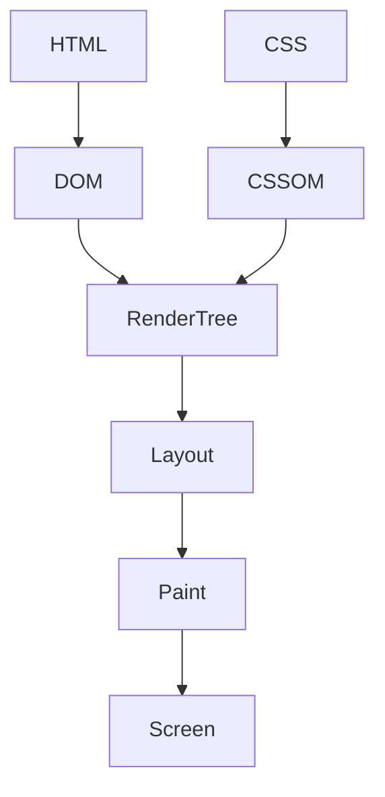
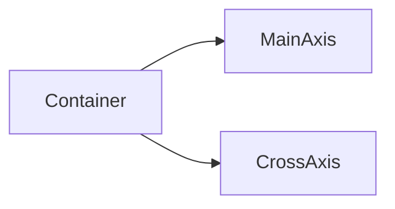
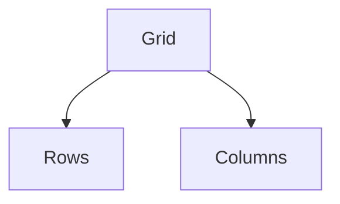
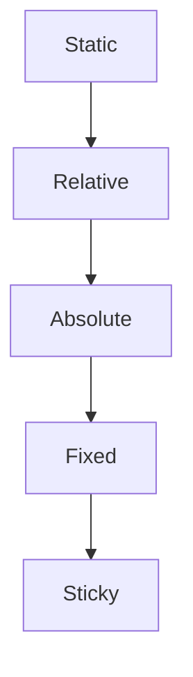
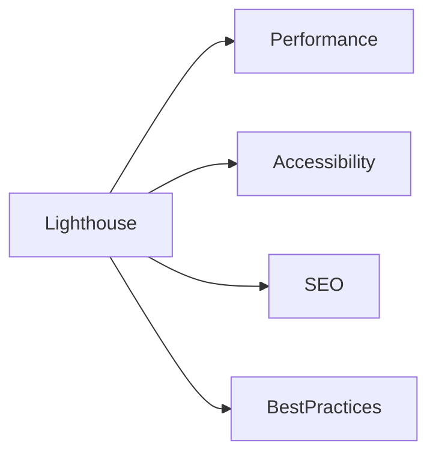
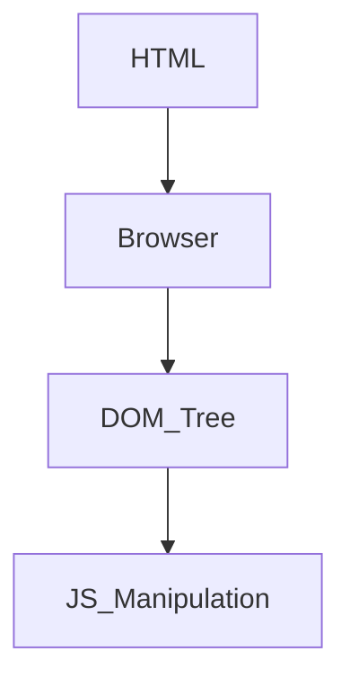
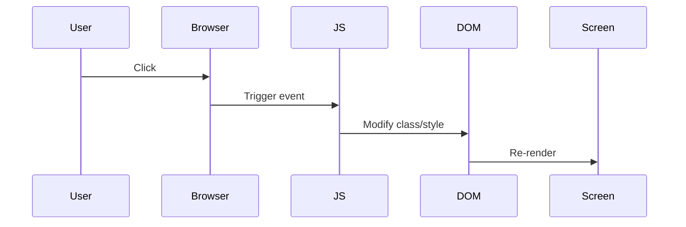

# Week 2: Advanced CSS & Design Systems

## 📌 Week Overview

This week you transition from **basic styling** to **professional frontend engineering**.

You will:
* Move from writing random CSS → building structured design systems.
* Understand how layout engines actually work.
* Learn how CSS interacts with the DOM.
* Build reusable, scalable UI architecture.
* Get a foundational introduction to the DOM & JavaScript (structure only, no heavy logic yet).

By the end of Week 2, your portfolio should look and behave like a **production-level static frontend**.

---

## 🎯 Learning Outcomes

* ✅ Master Flexbox & Grid layouts (deep understanding)
* ✅ Understand CSS positioning (static, relative, absolute, fixed, sticky)
* ✅ Implement animations & transitions properly
* ✅ Build accessible color systems
* ✅ Create reusable CSS components
* ✅ Structure CSS like a professional developer
* ✅ Understand DOM fundamentals
* ✅ Write basic JavaScript to interact with the page

---

## 📊 Key Concepts

---

## 🧠 How CSS Actually Works in the Browser

Before going deeper, understand this:



* DOM = HTML structure
* CSSOM = Parsed CSS rules
* Render Tree = Combined structure
* Layout = Calculate sizes & positions
* Paint = Draw pixels

💡 Performance insight:
Bad layout structure or excessive CSS can slow rendering.

---

# Flexbox Deep Dive [^1]

Flexbox is a **1-dimensional layout system** (row OR column).

---

## 🧭 Flexbox Mental Model



* Main Axis = controlled by `flex-direction`
* Cross Axis = perpendicular direction

---

```css
.flex-container {
    display: flex;
    flex-direction: row;        /* row | column */
    justify-content: center;    /* main axis */
    align-items: center;        /* cross axis */
    gap: 16px;
    flex-wrap: wrap;
}

.flex-item {
    flex: 1;              /* grow equally */
    flex: 0 1 200px;      /* grow shrink basis */
    order: 1;
}
```

### When To Use Flexbox
* Navbar
* Card alignment
* Buttons row
* Centering content
* Sidebar layouts (simple)

---

# CSS Grid [^2]

Grid is a **2-dimensional layout system** (rows AND columns).

---

## 🧩 Grid Mental Model



---

```css
.grid-container {
    display: grid;
    grid-template-columns: repeat(3, 1fr);
    grid-template-rows: auto 1fr auto;
    gap: 20px;
}

.grid-item {
    grid-column: span 2;
    grid-row: 1 / 3;
}

@media (max-width: 768px) {
    .grid-container {
        grid-template-columns: 1fr;
    }
}
```

---

## 📐 Flexbox vs Grid


| Feature     | Flexbox    | Grid        |
| ----------- | ---------- | ----------- |
| Dimension   | 1D         | 2D          |
| Best For    | Components | Page Layout |
| Alignment   | Strong     | Strong      |
| Overlapping | Hard       | Easy        |

---

# CSS Positioning [^3]

Positioning removes elements from normal flow.

---

## 🔄 Positioning Visual Model



---

```css
.static {
    position: static;
}

.relative {
    position: relative;
    top: 10px;
}

.absolute {
    position: absolute;
    top: 0;
    right: 0;
}

.fixed {
    position: fixed;
    top: 0;
    z-index: 1000;
}

.sticky {
    position: sticky;
    top: 0;
}
```

### Important Rule:
Absolute elements position relative to nearest parent with `position: relative`.

---

# Animations & Transitions [^4]

---

## 🎬 Transition vs Animation

| Transition               | Animation          |
| ------------------------ | ------------------ |
| Simple state change      | Complex timeline   |
| Triggered by hover/focus | Runs independently |
| Easy                     | More control       |

---

```css
.button {
    transition: background 0.3s ease;
}

.button:hover {
    background: darkblue;
}
```

---

```css
@keyframes fadeInUp {
    from {
        opacity: 0;
        transform: translateY(30px);
    }
    to {
        opacity: 1;
        transform: translateY(0);
    }
}

.card {
    animation: fadeInUp 0.6s ease forwards;
}
```

---

# Accessibility in CSS [^5]

Accessibility is NOT optional.

---

```css
.error {
    color: red;
    border-left: 4px solid red;
}

button:focus {
    outline: 2px solid black;
}

@media (prefers-reduced-motion: reduce) {
    * {
        animation-duration: 0.01ms !important;
    }
}
```

---

# 🎨 Design Systems & Color Tokens [^7]

Professional CSS uses design tokens.

```css
:root {
    /* Primary colors */
    --primary-500: #2d5f8d;
    --primary-700: #1a3a52;
    
    /* Secondary colors */
    --secondary-500: #70c1b3;

    /* Semantic colors */
    --success: #4caf50;
    --warning: #ff9800;
    --error: #f44336;
    --info: #2196f3;

    /* Neutral colors */
    --gray-50: #f9fafb;
    --gray-900: #111827;
    
    /* Spacing scale */
    --spacing-xs: 4px;
    --spacing-sm: 8px;
    --spacing-md: 16px;
    --spacing-lg: 24px;
    --spacing-xl: 32px;

    /* Border radius */
    --radius-sm: 4px;
    --radius-lg: 12px;
}
```

---

# 📁 Professional CSS Architecture

Structure your CSS file like this:

```css
/* 1. Reset */
/* 2. Variables */
/* 3. Base (body, h1, p) */
/* 4. Layout (grid, flex containers) */
/* 5. Components (card, button, navbar) */
/* 6. Utilities (text-center, margin helpers) */
```

---

# 💻 Daily Tasks

---

## Days 1-2: Flexbox Mastery

**Exercise**: Create a responsive navigation bar using Flexbox

```html
<nav class="navbar">
    <div class="nav-logo">YourName</div>
    <ul class="nav-menu">
        <li><a href="#home">Home</a></li>
        <li><a href="#about">About</a></li>
        <li><a href="#projects">Projects</a></li>
        <li><a href="#contact">Contact</a></li>
    </ul>
    <div class="hamburger">☰</div>
</nav>
```

```css
.navbar {
    display: flex;
    justify-content: space-between;
    align-items: center;
    padding: 16px;
    background: var(--primary-500);
}

.nav-menu {
    display: flex;
    list-style: none;
    gap: 30px;
}

.hamburger {
    display: none;
    font-size: 24px;
    cursor: pointer;
}

@media (max-width: 768px) {
    .nav-menu {
        display: none;
    }
    
    .hamburger {
        display: block;
    }
}
```

Focus:
* Perfect alignment
* Responsive collapse
* Clean spacing scale

**Commit**:
```
style(portfolio): implement structured flexbox navbar
```

---

## Days 3-4: CSS Grid Layout

**Exercise**: Create a portfolio grid layout

```css
.portfolio-section {
    display: grid;
    grid-template-columns: repeat(auto-fit, minmax(300px, 1fr));
    gap: 20px;
    padding: 40px;
}

.project-card {
    grid-column: span 1;
}

.featured-project {
    grid-column: span 2;     /* featured project spans 2 columns */
}

@media (max-width: 768px) {
    .featured-project {
        grid-column: span 1;  /* full width on mobile */
    }
}
```

Add:
* Featured card spanning
* Auto-fit + minmax
* Proper gap system

**Commit**:
```
style(portfolio): implement responsive grid layout
```

---

## Days 5-6: Animations & Polish

Correct version:

```css
.btn {
    transition: all 0.3s ease;
    transform: translateY(0);
}

.btn:hover {
    background: #1a3a52; /* manually define darker shade */
    transform: translateY(-2px);
    box-shadow: 0 4px 12px rgba(0,0,0,0.15);
}

.btn:active {
    transform: translateY(0);
}

/* Smooth scrolling */
html {
    scroll-behavior: smooth;
}
```

Add:
* Subtle hover transitions
* Avoid excessive animation
* Respect reduced-motion

**Commit**:
```
style(portfolio): add accessible animations
```

---

## Day 7: Accessibility Audit & Testing

Add this technical audit:



Minimum target:
* 80+ Performance
* 90+ Accessibility

---

# 🔹 DOM & JavaScript Fundamentals (Intro Only)

This week you start understanding **how JavaScript connects to HTML**.

---

## 🌳 What is the DOM?



The DOM is:
* A tree representation of HTML
* Accessible via JavaScript

---

## Selecting Elements

```html
<button id="toggleBtn">Click Me</button>
```

```javascript
const button = document.getElementById("toggleBtn");
```

Other selectors:
```javascript
document.querySelector(".className");
document.querySelectorAll("div");
```

---

## Basic Event Handling

```javascript
button.addEventListener("click", function() {
    alert("Button clicked!");
});
```

---

## Toggle Class Example (Practical)

```javascript
const menu = document.querySelector(".nav-menu");
const hamburger = document.querySelector(".hamburger");

hamburger.addEventListener("click", function() {
    menu.classList.toggle("active");
});
```

Corresponding CSS:
```css
.nav-menu {
    display: none;
}

.nav-menu.active {
    display: flex;
}
```

---

## 🧠 JavaScript Mental Model



---

## Why DOM Matters for MERN

Later you will:
* Fetch data
* Update UI dynamically
* Handle forms
* Build interactive apps

Today:
You understand structure.

---

# 📋 Week 2 Checklist

* [ ] Navbar fully responsive
* [ ] Grid layout implemented
* [ ] Proper CSS architecture
* [ ] No inline styles
* [ ] Color system defined
* [ ] Animations accessible
* [ ] Basic DOM interaction working
* [ ] Git commits daily

---

# 📚 Citations

[^1]: MDN Flexbox - https://developer.mozilla.org/en-US/docs/Learn/CSS/CSS_layout/Flexbox
[^2]: MDN Grid - https://developer.mozilla.org/en-US/docs/Learn/CSS/CSS_layout/Grids
[^3]: MDN Positioning - https://developer.mozilla.org/en-US/docs/Learn/CSS/CSS_layout/Positioning
[^4]: MDN Animations - https://developer.mozilla.org/en-US/docs/Web/CSS/CSS_Animations
[^5]: WCAG 2.1 - https://www.w3.org/WAI/WCAG21/quickref/
[^6]: WebAIM Contrast - https://webaim.org/articles/contrast/
[^7]: Design Tokens - https://www.figma.com/design-system/

---

# 🚀 Week 2 Outcome

You now understand:
* Layout engines
* Rendering pipeline
* Design systems
* CSS architecture
* Basic DOM manipulation

---

**Next**: [WEEK-03-04-JAVASCRIPT-TYPESCRIPT.md](./WEEK-03-04-JAVASCRIPT-TYPESCRIPT.md) - JavaScript & TypeScript Fundamentals
